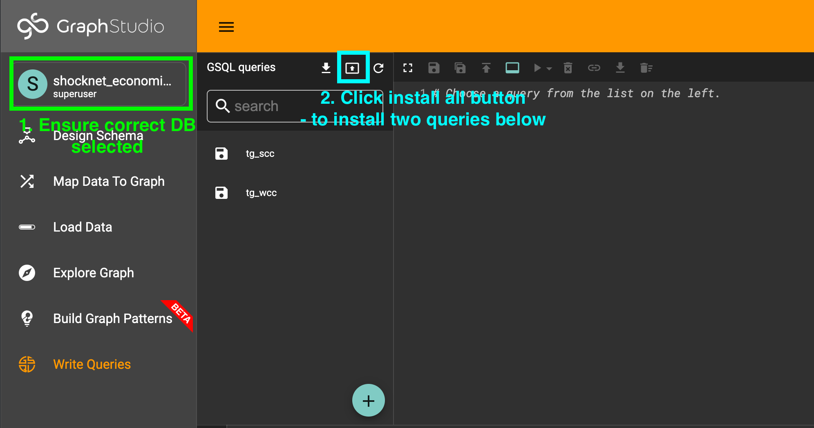
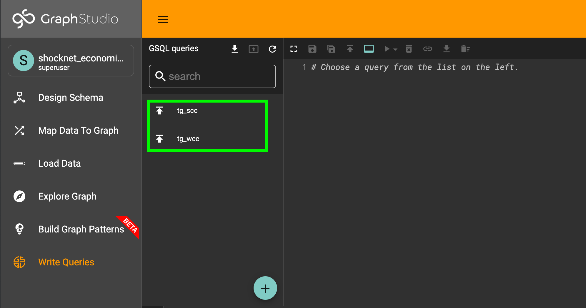

# ShockNet

If you just to install & run ShockNet, you can skip to [those instructions](#ways-to-run-shocknet)

**Contributers and Contact Information: Byron Thomas (refer to devPost for contact details)**

**Problem Statement addressed (or explain your own): Graph For Better Finance**

**Description**: 

Demo video: [ShockNet in action showing how it solves the problem statement](https://youtu.be/3O_CHwZjDwc)

ShockNet focuses on preventing crises by allowing policymakers to investigate how difficulties or decisions in one country can spread to another country. It contains a model of how economic shocks spread from country to country, causing crises, and comes with an app to allow policymakers to visualise and adjust the model, allowing them to understand in detail how crises spread, and to work out how to take avoiding / defensive action.

## What it does
ShockNet has an extracted version of economic cross-linkages (e.g. Mexico exports $10B of oil to Nicaragua; the production of Petroleum products in Nicaragua uses $2B of oil imports). These have been derived from the [Global Trade Analysis Project GTAP](https://www.gtap.agecon.purdue.edu/) database. The software uses a graph model of these cross-linkages to predict how supply shocks will spread through the world economy. The analyses available allow either: simulating a crisis that starts in a particular way (Effects analysis mode); finding what future crises might affect important sectors that the policymaker wishes to protect (Horizon scanning mode); determining which countries are the most likely to spread crises to each other (Groups analysis mode).

For more information on exactly what it does please refer to the [user guide](https://byronrthomas.github.io/ShockNetDocs/) or watch the [Demo video](https://youtu.be/3O_CHwZjDwc)

## More detail on how it works

How it works video: [ShockNet's dataset, use of graph technology, and software stack (4mins)](https://youtu.be/00j4S_U0LsQ)

TL;DR version of How it Works:
1. I derived data from GTAP database, and extract it into a file format ShockNet can use easily (stored in ./resources/gtap_extracted)
2. During initialisation, ShockNet writes this into TigerGraph DB as a set of countries, producers (production of a sector within a country), and importers (imports of a commodity to a single country)
3. ShockNet also adds edges to show the relationships of how producers use inputs (from other producers / importers)
4. When the ShockNet app is running, the user can change model assumptions on how important a given level of input / import is - this causes new "shock" edges to be written to the Graph DB
5. Using GSQL queries running from python, and Javascript to visualise, ShockNet then provides a set of analysis tools to help the user investigate and understand how supply shocks will pass from country to country and how to avoid crises - these operate on the "shock" edges version of the graph that bakes in the assumptions
6. I even used GSQL to run [data consistency checks](#running-self-checks) which helped to improve the development process by finding any badly written data

## How ShockNet is...

### Impactful in solving a real world problem 
ShockNet is designed to allow policy-makers to predict economic shocks, and to figure out which economic links are likeliest to cause shocks to reach them. Armed with this knowledge, policy-makers can work out effective responses, like temporarily subsidising a particular industry to prevent the shock spreading to more of the economy, or targeting welfare and support programmes at the sectors that are likeliest to experience job losses. Since the model is global then this benefit could be felt by all countries, but due to the nature of the model's predictions, countries that are most inter-linked to the world economy will be the most likely to benefit. For a big interconnected economy like the USA, this could be crucial. According to https://en.wikipedia.org/wiki/Job_losses_caused_by_the_Great_Recession - 8.8 million jobs were lost during recession caused by the Global Financial Crisis, if this number could be reduced a few percentage points, it would have a huge impact on people's lives and well-being.

### Innovative use case of graph
ShockNet focuses on adaptability of the model, and explainability of its results. One of the key innovations is baking the input-output links distilled from GTAP data in the graph during initialisation, and then using TigerGraph GSQL queries to transform (project) the graph into a shock graph - how shocks will connect the sectors and countries based on the user's current choice of modelling assumptions. Using this projection process, I can load the base data into the graph once and finally, but give the user the option to tweak their assumptions and support a wide range of analyses on the projected graph, so that they can investigate what the model predicts. By modelling shock transfer as edges in the graph, I can use graph algorithms like reachability and various path analyses to show shocks spread. The model can also apply standard graph algorithms (I use connected components from the Tigergraph data science library) to detect communities of countries that are most likely to transfer shocks between themselves.

In developing the front-end app, I applied the best in class technologies like d3.js to be able to visualise the graphs & paths effectively, and used metrics on edges (value and prevelance in shock chains) to highlight the areas a policymaker may want to focus to avoid crises.

### Ambitious
My distilled data from the GTAP database leads to an initial graph model of 16,278 nodes and around 400,000 edges, of a handful of types. The user can adjust their modelling assumptions, and update the model, which causes further edges to be inserted into the graph via the graph projection query I wrote. In order to prevent overloading the graph, which would give a poor user experience, I have set some bounds on the assumptions they can enter, so the maximum number of shock edges inserted is slightly over half a million edges (including reverse edges which make some of the analyses more convenient and performant). So slightly under a million edges is the total maximum (including the base edges and the shock edges that get inserted by the user's interactions).

I have added a range of functional features using GSQL queries I developed using GraphStudio. These are the graph projection query that conditions the graph, a breadth-first-search reachability analysis algorithm to detect the paths and shock spreads, data quality checks that aggregate the data and check against sensible constraints, and analyses of the path properties. In the UI I have added visualisations and interactions to help the user explore and see the most critical information. These include focusing on the longest (and hence more surprising paths), showing which countries are closely interconnected, and ranking edges and paths in terms of their likelihood and impact on the sectors the user is interested in.

### An applicable graph solution
Any organisation can download and run my code, and use it with their own instance of TigerGraph cloud. The repo comes with the distilled data resources need to initialise the graph. I have provided two different ways to run the app: from a docker container or by using python installed on their machine. This opens up the project to a very wide user base - as of April 2022, Python is the world's most popular programming language (https://www.tiobe.com/tiobe-index/), and DockerHub (where ShockNet can be pulled from) has 5M users (https://www.docker.com/blog/introducing-the-docker-index/). Hence the deployment technologies are common-place. The user can also play with a demo version of the app (https://shocknet.online), but this is not a multi-user system (it shares the same assumptions in the graph underneath), so ideally they should get their own TigerGraph instance. Almost any IT department would be able to help a user get running with these tools, and anybody who does any scientific computing or software development would also be capable of doing so without help.

As the app is a global model, literally any country's government, any economist or any investor who has an interest in this model will find that it already has the data they need.

### User documentation for ShockNet

ShockNet has a [user guide available online](https://byronrthomas.github.io/ShockNetDocs/) and this can also be accessed by clicking on the **?** icons within the app itself.

### Trial deployment of ShockNet

ShockNet is intended to be run locally against your own instance of Tigergraph cloud. However, for demonstration purposes, there is a single-user deployment of it [available](https://shocknet.online)

Please be aware that if multiple users are using the ShockNet demo site, they are sharing the same database, and same model assumptions, so they can clash with each other.

## Ways to run ShockNet
ShockNet can be run locally in one of several modes, in decreasing levels of convenience, but increasing levels of control
 - **Recommended:** run it with docker, you can pull down a prebuilt image and just run against a Tigergraph cloud instance
 - Back-end developers: run it locally using python 3.7
 - Front-end developers: run it locally using python 3.7 and node (Not recommended unless you really want to edit Javascript, this takes a fair bit of setup)

## Dependencies

Based on the [method you choose to run with](#ways-to-run-shocknet), the dependencies vary:
 - You always need an empty instance of Tigergraph cloud
 - If running the recommended way, you will need docker or similar container engine
 - If running as a developer, you will need python 3.7 or higher, and to run the front-end with freshly built assets, you will need to have node.js 16

The installation instructions below describe how to install the code dependencies once you have the above.

## Installation

You will need the basic tools described in the [dependencies section](#dependencies), and an empty Tigergraph cloud instance. Then follow instructions based on [which kind of installation you would like](#ways-to-run-shocknet) - it is highly recommended you use the docker or python methods only, this saves installing a lot of tools that are only necessary for those who want to change the code.

**IMPORTANT** Ensure Tigergraph is running before you run any shocknet commands or it
may hang indefinitely waiting for a connection.

### Installing & running using docker - recommended

Assuming you have docker on your system, the steps are as follows:
1. Create a directory where you like to run from, e.g. `mkdir shocknet`
2. Download the `.env.template` file in this repo into that directory
3. Rename it to be `.env`, i.e. `mv .env.template .env`
4. Edit the `.env` file to update the HOSTNAME, PASSWORD and USERNAME variables to the values needed to connect to your Tigergraph cloud instance

Run ShockNet to initialise the graph database for you, by running this from the same directory as your `.env` file:

`docker run -it -v $(pwd)/.env:/usr/src/app/.env --rm --name shocknet byronthomas712/shocknet:latest --initialise`

This will create the schema, by using the credentials from the `.env` file, and write all of the data into the
graph. It will also request a secret for accessing the database and write it back to the `.env` file.

Once this finishes, you will need to use Tigergraph GraphStudio to install queries - see instructions below [Installing queries in GraphStudio](#installing-queries-in-graphstudio), and then return here.

Once ShockNet has initialised, and you have installed the queries manually, then you can launch ShockNet, running in the same directory:

`docker run -it -p 127.0.0.1:9000:5000 -v $(pwd)/.env:/usr/src/app/.env --rm --name shocknet byronthomas712/shocknet:latest`

This will launch with the webserver running inside the container, available at port 9000, so to launch the
app, you just need to open your browser to http://127.0.0.1:9000 

### Installing & running - using Python

Assuming that you have python version 3.7 or higher and pip available locally (I suggest you use a tool like [pyenv](https://github.com/pyenv/pyenv) if you need to manage multiple python versions and dependency environments), you should do the following

1. Clone this repo
2. In the root folder that you cloned, copy the `.env.template` file to be `.env`, i.e. `cp .env.template .env`
3. Edit the `.env` file to update the HOSTNAME, PASSWORD and USERNAME variables to the values needed to connect to your Tigergraph cloud instance
4. Install the python dependencies locally using `pip install -r requirements.txt`

**NOTE**: the below commands assume your command to launch python >= 3.7 is `python` - depending on your setup, you might need to replace `python` with `python3` in the commands below.

Then you can run ShockNet to initialise the graph DB for you, from the root folder of this project run:

`python -m shocknet.start --initialise`

This will create the schema, by using the credentials from the `.env` file, and write all of the data into the
graph. It will also request a secret for accessing the database and write it back to the `.env` file.

Once this finishes, you will need to use Tigergraph GraphStudio to install queries - see instructions below [Installing queries in GraphStudio](#installing-queries-in-graphstudio), and then return here.

Once ShockNet has initialised, and you have installed the queries manually, then you can launch ShockNet, from the same directory:

`python -m shocknet.start`

This will launch with the webserver running locally, available at port 5000, so to launch the
app, you just need to open your browser to http://127.0.0.1:5000

### Installing and running with no pre-built assets (Developer-only not recommended)
Follow the instructions above for installing using python, but then refer to the [client readme](client/Readme.md) to follow
the instructions to get the Javascript dependencies installed locally and everything running in a dev server.

### Installing queries in GraphStudio

As part of the initialisation process, ShockNet creates two GSQL queries in GraphStudio, which need a manual
install step (it uses interpreted queries for several other use cases, but these two queries were not possible to run interpreted).

See below screenshots of GraphStudio to show how to proceed:
1. Select the correct graph (shocknet_economic_links)
2. Enter the "Write Queries" page
3. Click the "Install all" button
4. Wait for optimisation to finish (a few minutes normally)



After the process has finished the icons for the two queries should look like this:



### Troubleshooting

If you see any issues with starting shocknet - either it hangs indefinitely or gives an error like `local variable 'res' referenced before assignment` or `KeyError: 'HOSTNAME'` - double-check your .env file is present in the current directory, the credentials and hostname inside it are correct, and check that your Tigergraph instance is up and running.

If you get clashes with other graphs in the same instance, then you may have to drop them, you can pass the `--drop-all-schema` args to the initialise process to do this. Finally, if you have any issues with the secret, you can always manually create one in GraphStudio Admin page, and add it to the `.env` file either adding or replacing a line starting `SECRET=`.

## Known Issues and Future Improvements

- I would absolutely love to add some basic notions of demand shocks and elasticities, e.g. the user could toggle an assumption that the Petroleum sector in Nicaragua will cut production if it experiences a supply shock (hence passing a demand shock to the producers of its inputs as well as a supply shock to those who rely on it). I ran out of time to do this before the end of the submission period.
- It would be great to continue exploring which graph analyses and metrics are the most useful to the policymakers who might be able to prevent / avoid / reduce the impact of a crisis

## Reflections

### Challenges I ran into
In a multi-faceted project like this, there were a lot! Initially just finding, dissecting and understanding the economic data and models that were available was quite hard. I quickly realised that I wouldn't be able to come up with a quantitative solution to the problem, given my limited economics knowledge. Another huge challenge was visualising and interacting with the model in a meaningful way. Will users understand what the assumptions and results mean? I leant heavily toward natural language descriptions in the app, I felt explainability is important if the users want to have any kind of confidence in the app. I also tried to provide a fairly detailed [user guide](https://byronrthomas.github.io/ShockNetDocs/). What will the users need to see? Can I lay it out for them in a manner that's presentable and allows them to see the most critical information easily? This is something that took some experimentation, given my lack of front-end development experience.

### Accomplishments that I'm proud of
I'm really pleased that I managed to put together something usable, and makes use of the best in class available for the various bits of the challenge, even despite my lack of experience in all of them: existing economic models, TigerGraph, Python, Javascript, d3!

## References

### GTAP 8 Data Base
Narayanan, G., Badri, Angel Aguiar and Robert McDougall, Eds. 2012. Global Trade, Assistance, and Production: The GTAP 8 Data Base, Center for Global Trade Analysis, Purdue University

I extracted this data using the steps documented [here](./docs/data-extraction.md)

### Software development projects that inspired me and I leaned on heavily
* [PyTigerGraph](https://pytigergraph.github.io/pyTigerGraph/)
* [TigerGraph In-Database Graph Data Science Algorithm Library](https://github.com/tigergraph/gsql-graph-algorithms)
* [pandas](https://pandas.pydata.org/)
* [d3.js](https://d3js.org/) and [their examples](https://observablehq.com/@d3/gallery)
* [DataMaps](http://datamaps.github.io/)


## Developing ShockNet

### Package for Docker
In order to build the JS assets for docker, and tag a new docker image run from the root:

```
BUILD_FOR_DOCKER=1 ./build-client.sh && docker build -t shocknet:0.5.6 .
```

Do not check in the updated JS assets.

### Package for Python
In order to simply build for serving from python running locally

```
./build-client.sh
```

This will place the JS assets in the python static assets folder - you should check these in.

### Running self-checks

If you are concerned you might have some buggy data, there are a range of interpreted GSQL queries in `./resources/gsql_queries/check*.sql` - you can either copy-paste these to use directly in GraphStudio, or if you perform a GET request against the self-check endpoint they will all be run and the results returned (i.e. `curl http://127.0.0.1:9000/self-check` OR `curl http://127.0.0.1:5000/self-check`). All of the result lists should be empty if there aren't any issues
